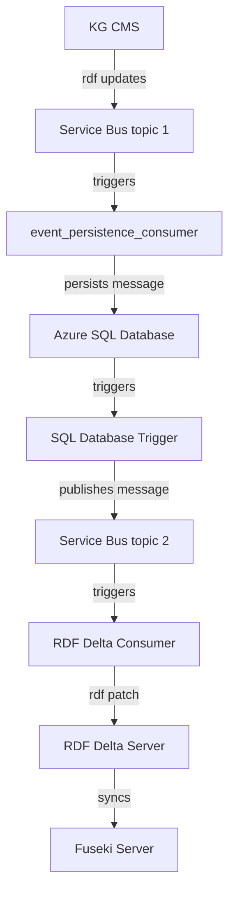

# GSWA Event Services

This repository contains several microservices that make up the GSWA Event System.

## Services Overview



### Event Persistence Consumer

Source code: [event_persistence_consumer](./event_persistence_consumer)

Consumes messages from a service bus topic and persists them to Azure SQL Database.

### SQL Database Trigger

Source code: [db_trigger](./db_trigger)

Publishes rows from Azure SQL Database to a service bus topic.

### RDF Delta Consumer

Source code: [rdf_delta_consumer](./rdf_delta_consumer)

Consumes messages from a service bus topic and sends them to RDF Delta Server.

## Deployment

### Pre-requisites

The Function apps in this repository depend on the following Azure services

- Azure Service Bus
- Azure SQL Database

These services will need to be deployed and maintained seperately to this repository.

#### Service Bus

The service bus instance will need to have two topics each with a sessionful
subscription.

#### Azure SQL DB

The Azure SQL instance will need to have change tracking enabled and an event table
created. It will also need to support Microsoft Entra ID authentication, so that the
function apps can connect to it using their sysem managed identities.

##### Configuration

Once the SQL Database has been created, use the Query Editor or other SQL DB management
tool to execute the following SQL statements.

1. Enable change tracking on the databse.

```sql
IF NOT EXISTS (SELECT * FROM sys.change_tracking_databases WHERE database_id = DB_ID('<database-id>'))
BEGIN
    ALTER DATABASE [<database-id>]
    SET CHANGE_TRACKING = ON
    (CHANGE_RETENTION = 2 DAYS, AUTO_CLEANUP = ON)
END
```

> where _\<database-id>_ is the name of the Azure SQL Database

2. Create the Event table.

```sql
IF NOT EXISTS (SELECT * FROM sys.tables WHERE name = 'Event')
BEGIN
    CREATE TABLE Event (
        EventID BIGINT IDENTITY(1,1) PRIMARY KEY,
        EventHeader NVARCHAR(4000),
        EventBody NVARCHAR(MAX),
        EventPublished BIT DEFAULT 'FALSE'
    )
END
```

3. Enable change tracking on the Event table.

```sql
IF NOT EXISTS (SELECT * FROM sys.change_tracking_tables WHERE object_id = OBJECT_ID('Event'))
BEGIN
    ALTER TABLE [Event]
    ENABLE CHANGE_TRACKING
    WITH (TRACK_COLUMNS_UPDATED = ON)
END
```

4. Add users to the database (detailed in the
   [Event Persistence Consumer](./event_persistence_consumer/README.md) and
   [SQL Database Trigger](./db_trigger/README.md) readme's).

5. Ensure firewall exceptions are in place to allow communication with the Event
   Persistence Consumer and SQL Database Trigger apps.

Refer to the following readme's for deployment and configuration of each function app

- [Event Persistence Consumer](./event_persistence_consumer/README.md)
- [SQL Database Trigger](./db_trigger/README.md)
- [RDF Delta Consumer](./rdf_delta_consumer/README.md)

## Testing

To test the operation of the function app you can submit a message to the first service
bus topic with the following parameters:

```
content_type: text/plain
metadata: { "https://schema.org/encodingFormat": "application/trig" }
session_is: mysessionid
body:
  <http://mygraph> {
    <a> <b> <c> .
  }
```

Which using the service bus explorer would look like:

...

To check the flow of the message through the system at different stages:

1. from service bus topic 1 to azure sql db (via the event_persistence_consumer)

   execute the following statement against the azure sql db

   ```sql
   SELECT TOP (10) * FROM [Event]
   ```

2. from azure sql db to service bus topic 2 (via the db_trigger)

   use service bus explorer to peak messages on the topic

   > this may not show anything if the message has already been processed of to RDF
   > Delta server.

   you can also run the sql query from step 1 and check the EventPublished value.
   if it is true then the message should have been sent off to service bus topic 2.

3. from service bus topic 2 to rdf delta server.

   check the logs for RDF Delta server for incoming patches.

4. from rdf delta server to fuseki server.

   query fuseki server for the data that was sent in the test message using the example
   at the top, this query would look like:

   ```bash
   curl https://myfusekiserver/myds/sparql --data 'select * where { graph
   <http://mygraph> { ?s ?p ?o } }'
   ```

## Local Development

### Dependencies

- Azure functions core tools
- Python 3.12
- Microsoft ODBC Driver 18
- _Service Bus Emulator_
- _SQL Server_

You can also use devcontainers to develop against the local equivalent of service bus
and azure sql db. See below for details. This may be preferable is installing these
dependencies natively can be tricky.

#### Dev Containers

The recommended way to do development is to use (VS Code with the Dev Container extension)[https://code.visualstudio.com/docs/devcontainers/containers].

Before doing anything, first create a `.env` file in the `.devcontainer` directory. Copy the contents of the `.env-template` file into the `.env` file and fill in the values. Note that this same database password needs to be set for any dependent services that connect to the database.

Now, open the project in VS Code and search for "Dev Containers: Rebuild and Reopen in Container" in the Command Palette. This will build the dev container and reopen the project in the container using the docker engine. By using this method, you can ensure your dev environment has all of the necessary dependencies and tools installed to develop with Azure Functions and Azure SQL Managed Instance.

You will now have all of the .NET dependencies required to run a local instance of SQL Server along with go-task and uv for managing python.

Last step before developing, click on the extensions tab to ensure all of the extensions are loaded. Some may say the window needs to be reloaded. Click it to allow it to reload and initialise correctly.

> [!NOTE]
> A warning from the Azure extension may appear to complain that it has found multiple function apps in the one project. Just ignore this, we are not using any features from the extension for functions.

##### Local SQL Server

The local SQL Server is running in a docker container when the dev container starts. An easy way to view the database is to use the `ms-mssql` extension in VS Code. Once installed, you can connect to the local SQL Server by opening the SQL Server view.

Right-clicking on `LocalDev` will allow you to lodge a SQL query to test your connection. Paste the following query in, right-click the file window and click "Execute Query".

```sql
SELECT name
FROM sys.tables
```

##### sqlcmd

Alternatively, you can use the `sqlcmd` command to connect to the local SQL Server.

```bash
sqlcmd -S localhost -U sa -P password
```

For example, to drop a database.

```sql
DROP DATABASE rdf_delta;
GO
```

Use the `-d` flag to specify the database when connecting using `sqlcmd`.

```bash
sqlcmd -S localhost -U sa -P password -d rdf_delta
```
